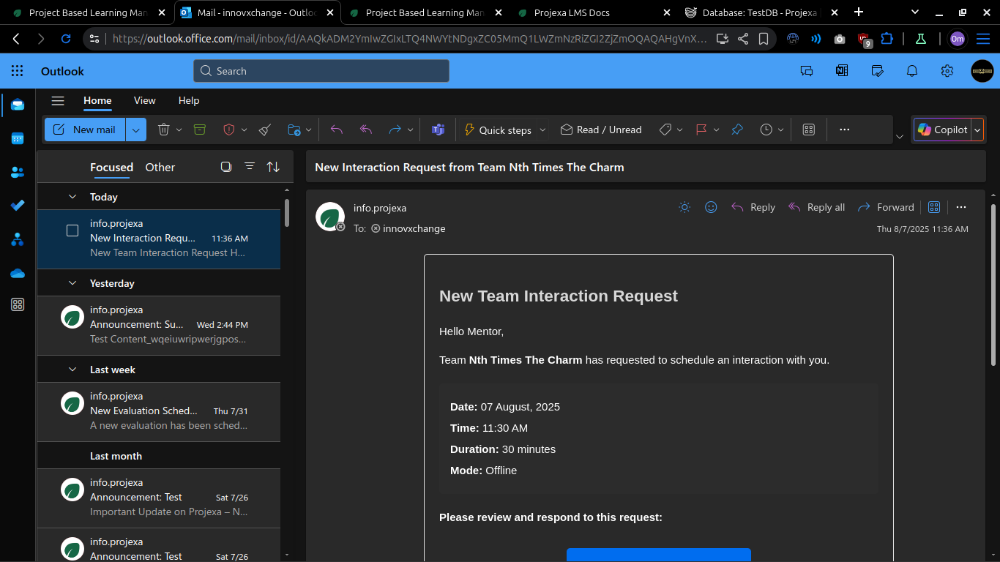
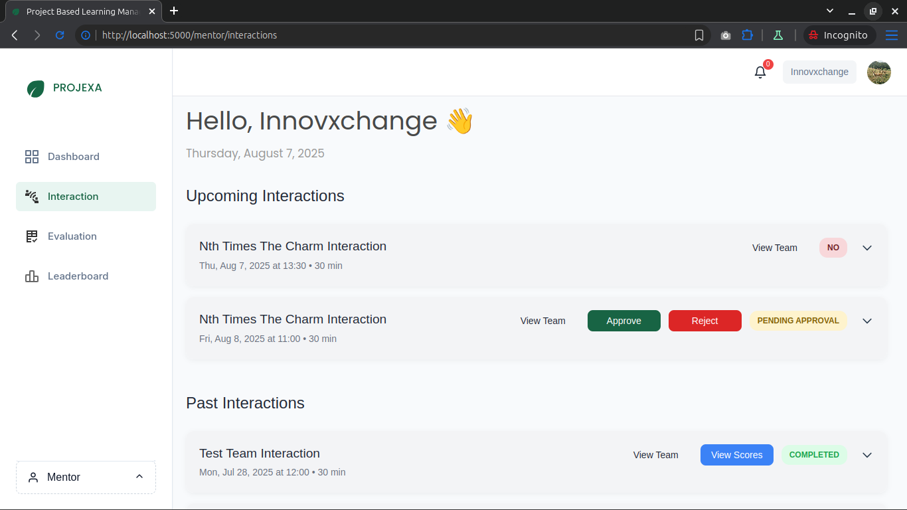
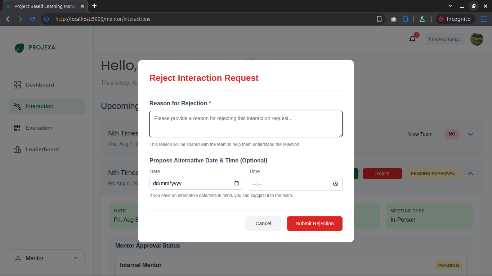
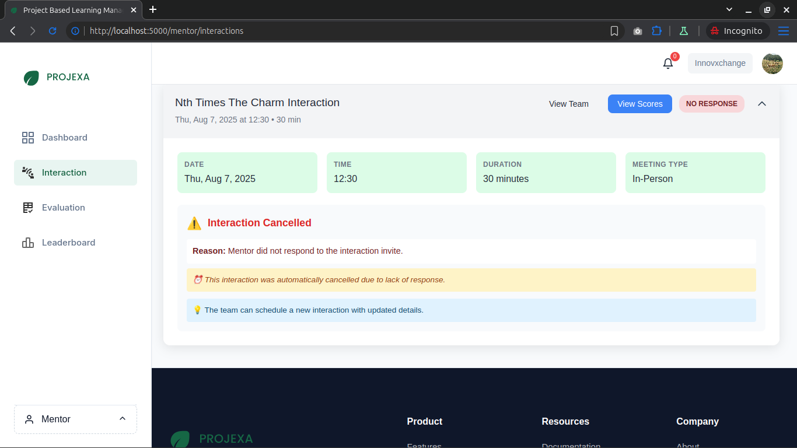
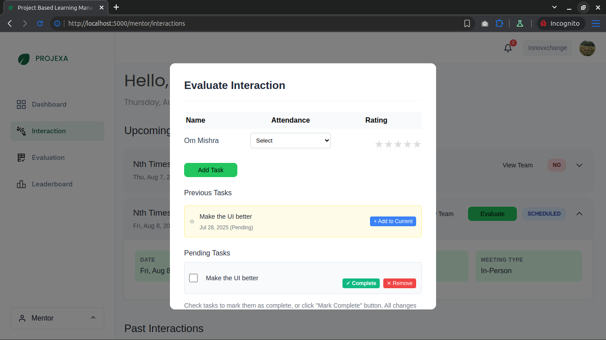

# Handling Interactions

This guide explains how mentors can handle team interaction requests in Projexa LMS.

## 1. Receiving an Email
- Mentors will receive an email notification when a team requests an interaction.

## 2. Approving or Rejecting the Interaction
- The email contains a button. Click it to open the dashboard and view the interaction request.
- On the dashboard, you can **Approve** or **Reject** the interaction.

### If Rejected
- Optionally, provide a new date and time to reschedule the interaction.

### If No Response
- If you do not respond in time, the interaction will be automatically cancelled.
- An email will be sent to the concerned team, reminding them not to repeat this behavior.

## 3. After Approval
- Once approved, an **Evaluation** button will appear for the interaction.
- You can:
  - Rate each student (1-5) based on their contributions.
  - Assign future tasks.
  - Mark previous or future tasks as complete.
  - Upload a few photos from the interaction.
  - Click **Save** to submit your evaluation and updates.

