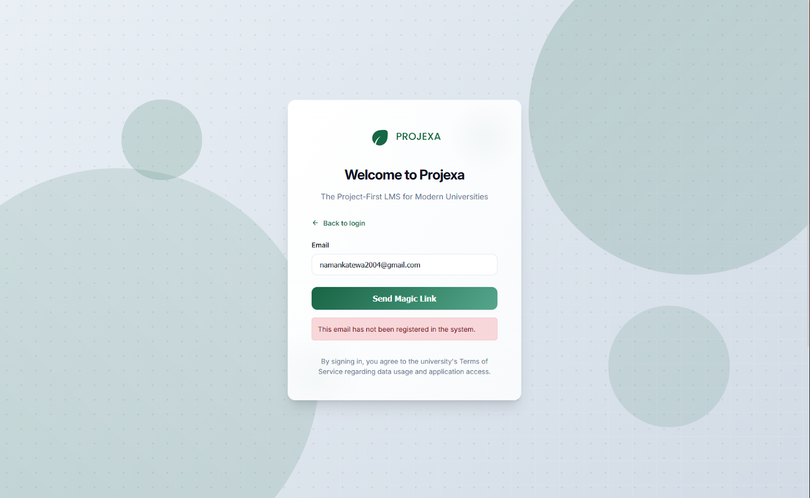
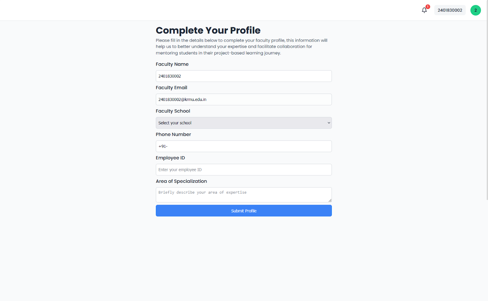

> **Note:** This login method is for external mentors only.

# Logging In with a Magic Link (for Personal Emails)

This convenient method provides a passwordless login for users who are not using a university email address. It's quick, secure, and eliminates the need to remember another password.

**What You'll Experience:**

**The Magic Link Form:** After entering your personal email and clicking "Continue," the login screen will transform. You'll see a message indicating that a magic link will be sent to your email, with your email address already pre-filled.

**Sending the Magic Link:** Click the "Send Magic Link" button. Projexa will then send a unique, secure login link to your inbox.

**Checking Your Email:** Open your email client (e.g., Gmail, Outlook, Yahoo Mail) for the email address you just entered. Look for an email from Projexa.

**Opening the Magic Link Email:** Open the email from Projexa. Inside, you'll find a prominent "Log In" button or a direct link.

**Logging In Instantly:** Click the "Log In" button or the magic link within the email. This action will instantly log you into Projexa and take you directly to your dashboard.

---

# Faculty Profile Completion: "Fill Your Information"

> **Note:** This section is for faculty members only.

This is a crucial step specifically for faculty members who are logging in for the first time or whose profiles are not yet fully complete. It ensures we have the necessary details to provide you with the best experience.

**What You'll Experience:**

**Automatic Redirection:** If your faculty profile isn't complete after your initial login, Projexa will automatically direct you to a dedicated "Complete Your Profile" page. You won't be able to access other parts of the application until this is done.

**Filling Out Your Details:** On this page, you'll find a form asking for important details. Some fields, like your Full Name and Email, might be pre-filled (your email cannot be changed here). You'll need to accurately fill in:

- **Your School:** The name of your academic school or department.
- **Phone Number:** Your contact phone number.
- **Employee ID:** Your unique employee identification number.
- **Area of Specialization:** Your primary academic or professional area of expertise.

**Submitting Your Profile:** Once all fields are completed, click the "Submit Profile" button. Projexa will then save your details and mark your profile as complete.

**Accessing Your Faculty Dashboard:** After successfully submitting your profile, you will be automatically taken to your Faculty Dashboard, signifying that your onboarding is complete and you can now fully utilize Projexa.

---

# Personalizing Your Profile: Uploading Your Profile Picture

> **Note:** This section is for everyone.

Your profile picture helps personalize your experience on Projexa, making your interactions more engaging and recognizable.

**What You'll Experience:**

**Prompt to Upload:** If you don't yet have a profile picture associated with your account, Projexa will guide you to a dedicated page to upload one. This ensures your profile is complete and ready for collaboration.

**Selecting and Cropping Your Image:**

- **Select Image:** Click on the designated area (e.g., "Click to select an image") to open your file explorer. Choose an image file (JPG or PNG are recommended).
- **Cropping Tool:** Once selected, your image will appear within a cropping tool. This tool allows you to adjust the image, zoom in or out, and select the perfect square area for your profile picture. This ensures your picture looks great and fits perfectly.

**Saving Your Profile Picture:** After you've adjusted the crop to your liking, click the "Save Profile Picture" button. Projexa will process your image and update your profile.

**Your New Profile Picture:** Once saved, you'll be redirected back to your dashboard or profile page, where your newly uploaded and cropped profile picture will be prominently displayed.

