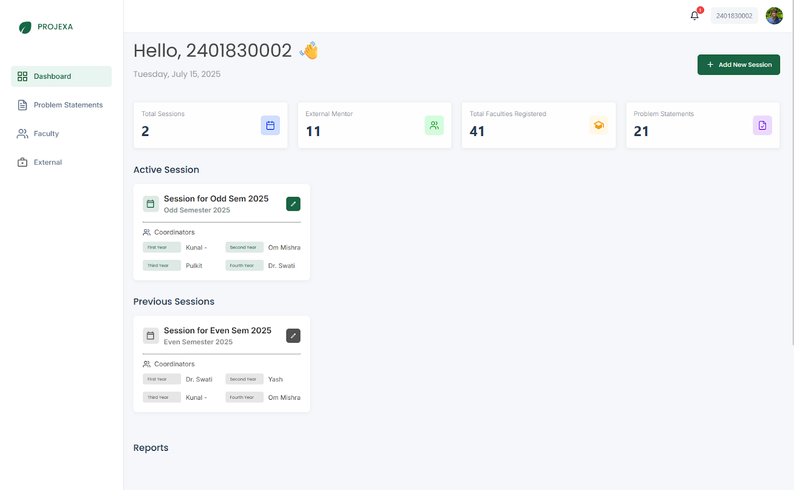

> **Note:** This login method is for all students and internal faculty.

# Logging In with Your University Account (Microsoft Azure AD)

This method is specifically designed for users with university-provided email addresses, offering a secure and familiar login experience through your existing Microsoft account.

**What You'll Experience:**

1. **Redirection to Microsoft Login:** After entering your university email and clicking "Continue," you will be automatically and securely redirected to an official Microsoft login page. This is a standard procedure for institutional accounts, ensuring your data remains protected.  
   
   

2. **Completing Microsoft Authentication:** On the Microsoft page, you will enter your university username and password. If your institution uses multi-factor authentication (MFA), you will complete that step as well.  
   
   

3. **Landing in Projexa:** Once authenticated with Microsoft, you will be securely redirected back to Projexa. The system will recognize you and direct you to your personalized area.  
   
   
