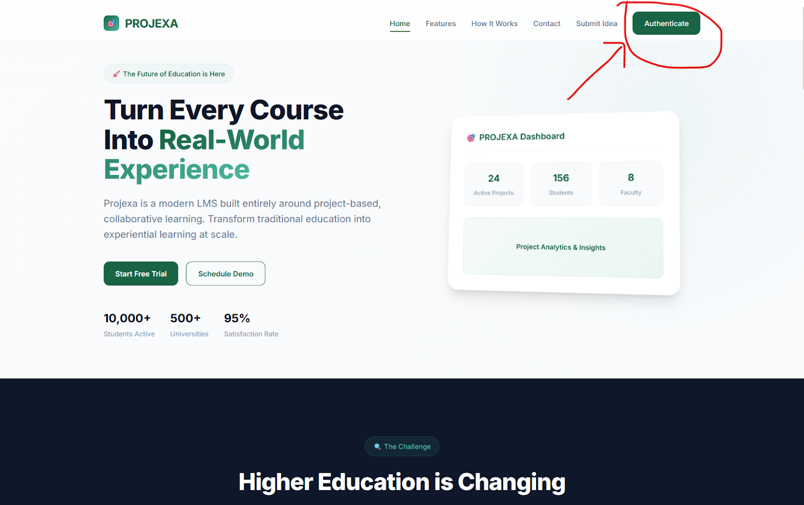
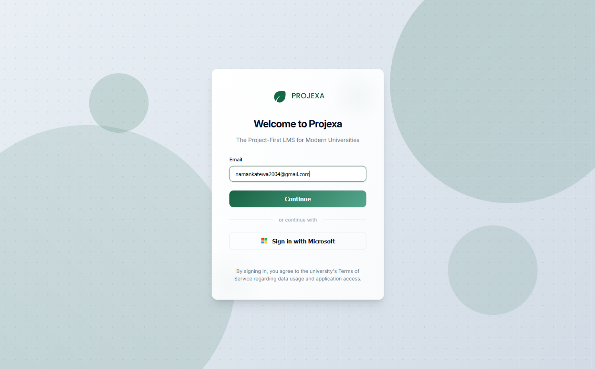
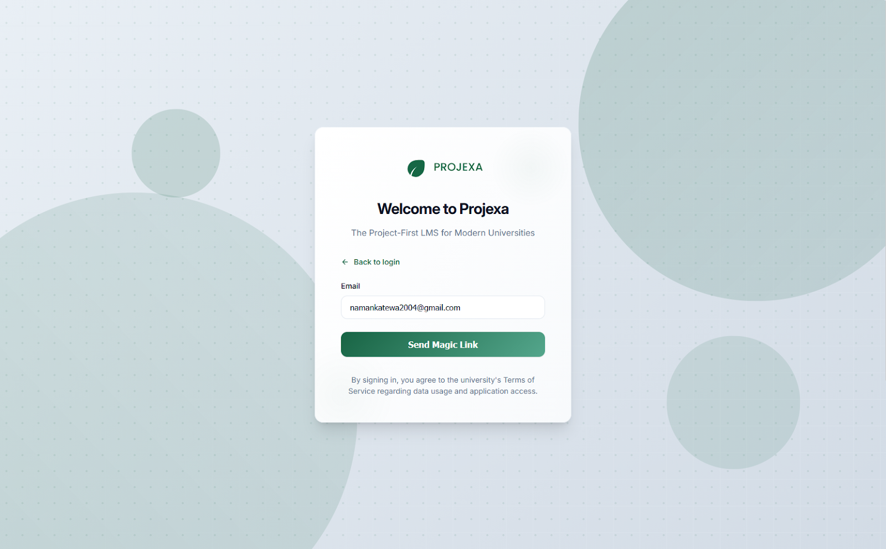

# Projexa Onboarding Flow: Your First Steps

Welcome to Projexa! This comprehensive guide will walk you through every step of getting started, ensuring a smooth and clear onboarding experience. We'll cover how you access the system, complete your profile (especially for faculty), and personalize your account with a profile picture.

## Starting Your Journey: How You Log In

Your journey with Projexa begins the moment you visit our login page. We've designed a smart system to get you to your dashboard as quickly and securely as possible.

**What You'll Experience:**

**Arriving at the Login Page:** You'll navigate to the Projexa login page in your web browser. Here, you'll see a clean, intuitive interface with a prominent field asking for your email address.

**Entering Your Email:** Type your email address into the designated field. As you do this, Projexa is already working behind the scenes to determine the best way to log you in.

**Clicking "Continue":** After entering your email, click the "Continue" button. Projexa will then intelligently route you to the appropriate login method based on your email domain.

