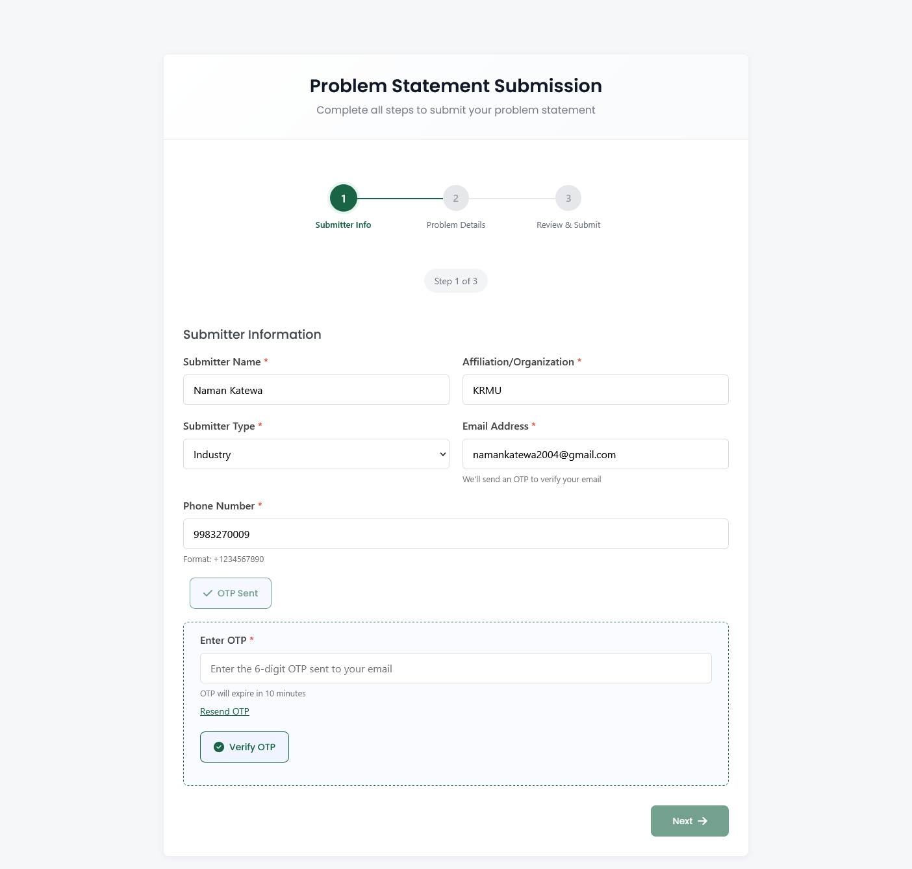
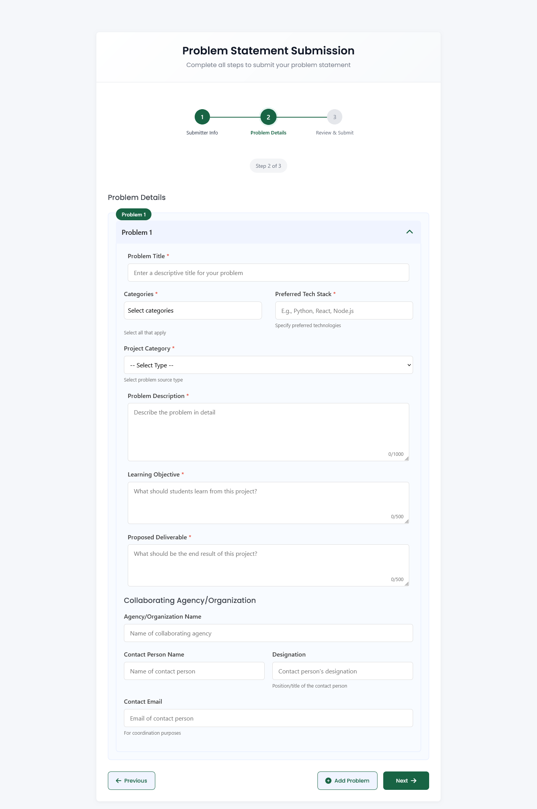
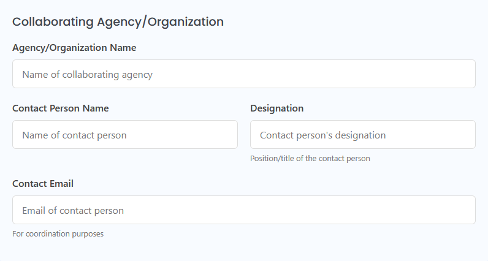
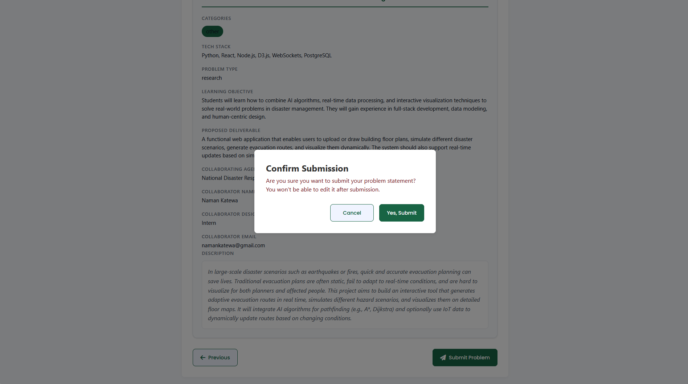

> **Note:** To access the Idea Submission form, you must be logged out. The form is available at: `https://projexa.ai/idea-submission`

# Idea Submission Process

This document outlines the step-by-step process for submitting new problem statements or ideas through the Projexa platform. The submission process is designed to be intuitive, guiding you through providing necessary details and verifying your identity.

## Overview of the Idea Submission Process

The idea submission form is a multi-step process, ensuring all required information is captured accurately. It involves:

1.  **Submitter Information:** Providing your personal and organizational details.
2.  **OTP Verification:** Verifying your email address for security.
3.  **Problem Details:** Describing your problem statement(s) in detail.
4.  **Review & Submit:** Reviewing all entered information before final submission.

## Step 1: Submitter Information

This section collects basic information about the person submitting the idea. All fields marked with an asterisk (\*) are required.

- **Submitter Name:** Your full name.
- **Affiliation/Organization:** The name of your organization or institution.
- **Submitter Type:** Your role (e.g., Faculty, Industry).
- **Email Address:** Your email address. An OTP will be sent to this email for verification.
- **Phone Number:** Your contact phone number (format: +1234567890).

### OTP Verification

After filling in your submitter information, you must verify your email address using a One-Time Password (OTP).

1.  **Send OTP:** Click the "Send OTP" button. An OTP will be sent to the email address you provided.
2.  **Enter OTP:** Enter the 6-digit OTP received in your email into the designated field. The OTP is valid for 10 minutes.
3.  **Verify OTP:** Click the "Verify OTP" button. Once verified, you can proceed to the next step. You can also resend the OTP if needed after a short waiting period.

## Step 2: Problem Details

In this step, you will provide the specifics of your problem statement(s). You can add multiple problem statements if needed.

- **Problem Title:** A concise and descriptive title for your problem.
- **Categories:** Select relevant categories that your problem falls under (e.g., Education, Healthcare, Environment, Technology). You can select multiple categories.
- **Preferred Tech Stack (Optional):** Specify any preferred technologies or frameworks for solving this problem (e.g., Python, React, Node.js).
- **Problem Description:** A detailed explanation of the problem you are presenting.
- **Learning Objective (Optional):** What should students learn from working on this project?
- **Proposed Deliverable (Optional):** What should be the expected end result or outcome of this project?

### Collaborating Agency/Organization (Optional)

If your problem statement involves a collaborating agency or organization, provide their details:

- **Agency/Organization Name:** The name of the collaborating entity.
- **Contact Person Name:** The name of the contact person from the collaborating agency.
- **Contact Email:** The email address of the contact person for coordination purposes.

## Step 3: Review & Submit

Before finalizing your submission, this step allows you to review all the information you have entered.

- Carefully check all details for accuracy.
- Once you are satisfied, click the "Submit Problem" button.
- A confirmation popup will appear. Confirm your submission to finalize the process.

Upon successful submission, you will receive a confirmation, and your problem statement(s) will be recorded in the system.

