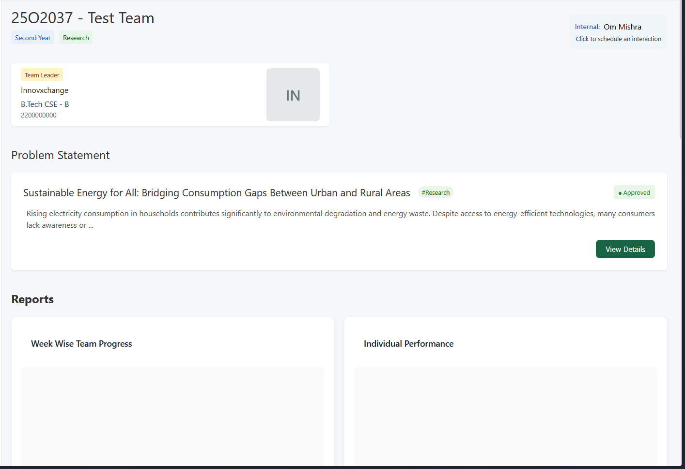
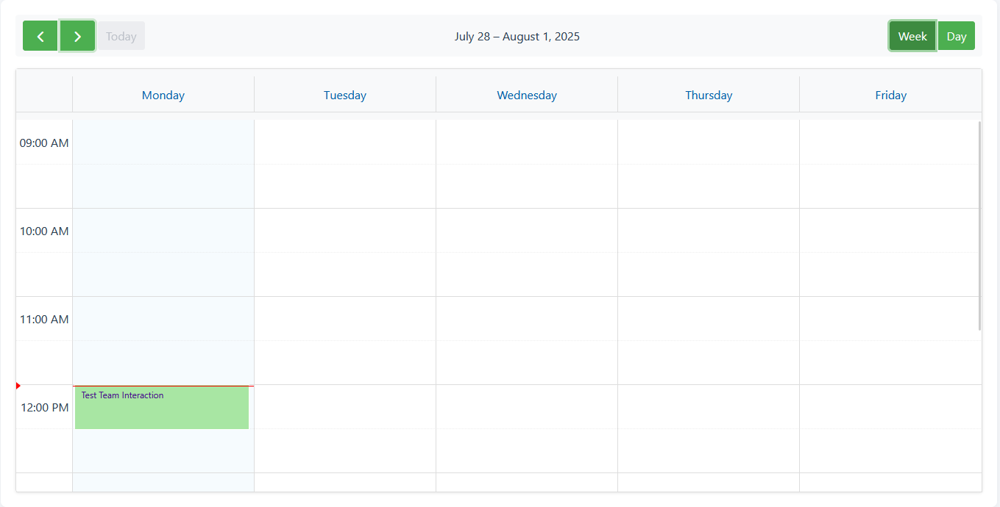

# Team Interaction

This section is for students working in teams on Projexa. Here, you'll learn how to communicate, collaborate, and make the most of your mentor support.

## Working Together as a Team

Projexa gives you easy-to-use tools to chat, share ideas, and work closely with your teammates and mentor.

### Your Mentor

Every team is matched with a mentor—someone who will guide you, answer your questions, and help you succeed throughout your project.

### Scheduling Meetings with Your Mentor

As a team, you can schedule meetings with your mentor right from their page. These meetings are your chance to update your mentor on your progress, discuss any hurdles you're facing, and get expert advice.

### How Projexa Helps Manage Meetings

Projexa takes care of some meeting details for you:

*   **Reminders:** Both you and your mentor will get automatic reminders before your meetings.
*   **Auto-Cancellation:** If your mentor doesn't respond to a meeting request in time, Projexa will cancel the meeting and let you know by email. Don't worry—no points will be deducted if a meeting is auto-cancelled by the system.
*   **Minimum Meetings:** There is a minimum number of meetings your team needs to complete. The exact number will be shared with you through official announcements, so keep an eye out for updates.

### Feedback and Improvement

After each meeting, your mentor will rate your team's performance and give feedback. This is important for your team's overall evaluation and success.

