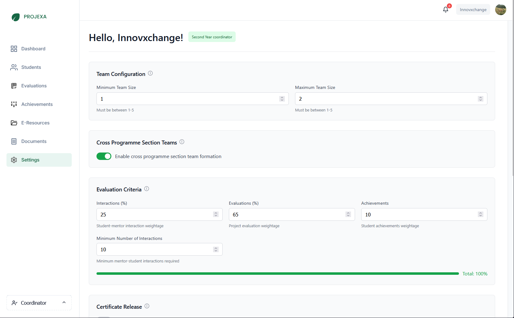
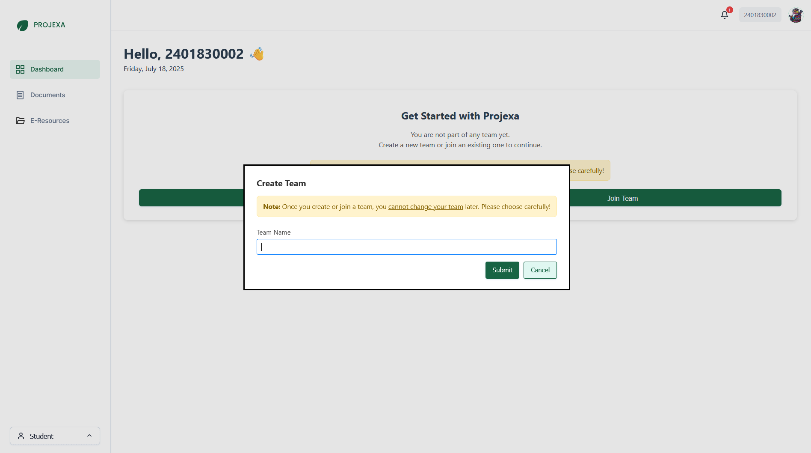
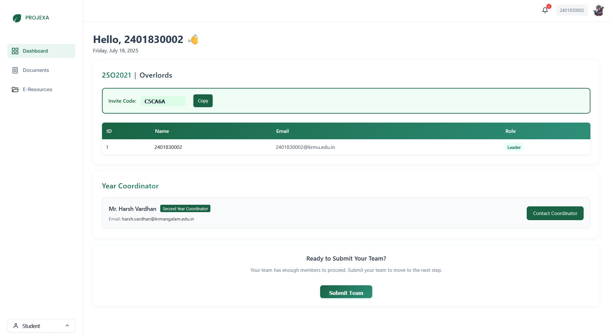
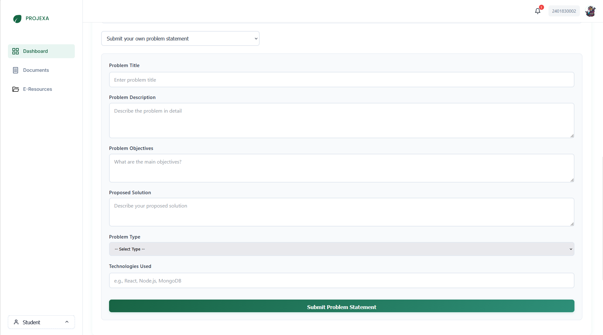

## 1. Team Management

Teams are a core component of the Projexa experience, enabling collaborative project work. The system provides robust features for team formation and management.

### Team Size Configuration

Projexa enforces specific team size limits to ensure effective collaboration and project management. These limits are set by coordinators.

*   **Minimum Team Size:** The smallest number of participants allowed in a team.
*   **Maximum Team Size:** The largest number of participants allowed in a team.

### Cross-Section Teams

The system can be configured to allow students from different academic sections to form teams together. This allows for more diverse team compositions.

### Creating a New Team

If you are a team leader or starting a new project, you can create a new team.

1.  Navigate to your **Student Dashboard**.
2.  Click on the **"Create Team"** button.
3.  Enter your desired **Team Name** in the dialog box.
4.  Click **"Submit"**.
    
    

### Joining an Existing Team

If you are joining an existing team, your team leader will provide you with a **Team Code**.

1.  Navigate to your **Student Dashboard**.
2.  Click on the **"Join Team"** button.
3.  Enter the **Team Code** provided by your team leader.
4.  Click **"Submit"**.
    

### Understanding Team Roles

Within your team, members will have specific roles:

- **Leader:** The team leader is responsible for submitting the team, problem statements, and managing the GitHub repository.
- **Member:** Team members collaborate on the project and contribute to its development.
  

### Submitting Your Team (Team Leaders Only)

Once your team has the required number of members, the team leader must submit the team to proceed.

1.  Ensure all team members have joined.
2.  On the **Student Dashboard**, click the **"Submit Team"** button.

## 2. Problem Statement Submission

After your team is submitted, the team leader can proceed to submit the problem statement for your project.

### Overview

The problem statement section allows you to either select a pre-defined problem from a list provided by mentors, or propose your own.

> **Note:** Any new problem statements you propose will require approval from your coordinators.

### Selecting an Existing Problem

1.  From the **Student Dashboard**, locate the "Submit Problem Statement" section.
2.  Use the dropdown menu to select an existing problem statement.

### Submitting a New Problem

If you are proposing a new problem, fill in the following details:

- **Problem Title:** A concise and descriptive title for your project.
- **Problem Description:** A detailed explanation of the problem you aim to solve.
- **Problem Objectives:** What are the main goals and outcomes of your project?
- **Proposed Solution:** Describe your approach to solving the problem.
- **Problem Type:** Categorize your problem (e.g., Research, Industry, University Problem Based, Startup).
- **Technologies Used:** List the key technologies, frameworks, and languages you plan to use.
  

### Connecting GitHub Repository (Team Leaders Only)

It is mandatory to connect a GitHub repository to your project. This allows mentors to track your progress.

1.  In the "Submit Problem Statement" section, find the **"GitHub Repository"** area.
2.  Click **"Authorize GitHub Access"** and follow the prompts to connect your GitHub account.
3.  Once authorized, select your project's repository from the dropdown list.
4.  Click **"Save Repository"**.
    

## 3. Uploading Supporting Documents (for Industry Projects)

If your project is an "Industry" type, you will need to upload supporting documents to verify your association with the industry expert.

### When to Upload

You will be prompted to upload these documents after your problem statement is submitted and approved (if applicable).

### How to Upload

1.  Navigate to the **"Industry Supporting Documents"** section (usually accessible from the sidebar).
2.  Drag and drop your file into the designated area, or click **"Choose File"** to browse.
3.  Supported formats: PDF, DOC, DOCX, JPG, PNG. Maximum size: 5MB.

### Checking Document Status

You can view the status of your uploaded documents (Pending, Approved, Rejected) in the "Your Documents" list. If a document is rejected, a reason will be provided.

## 4. Dashboard Overview & Getting Help

### Dashboard Overview

Your Student Dashboard provides quick access to:

- Your team's details and members.
- Problem statement submission and status.
- Coordinator information.
- Links to other relevant sections like E-Resources, Announcements, etc.

### Getting Help

If you encounter any issues or have questions, please reach out to your assigned year coordinator. Their contact information is available on your Student Dashboard.

---
